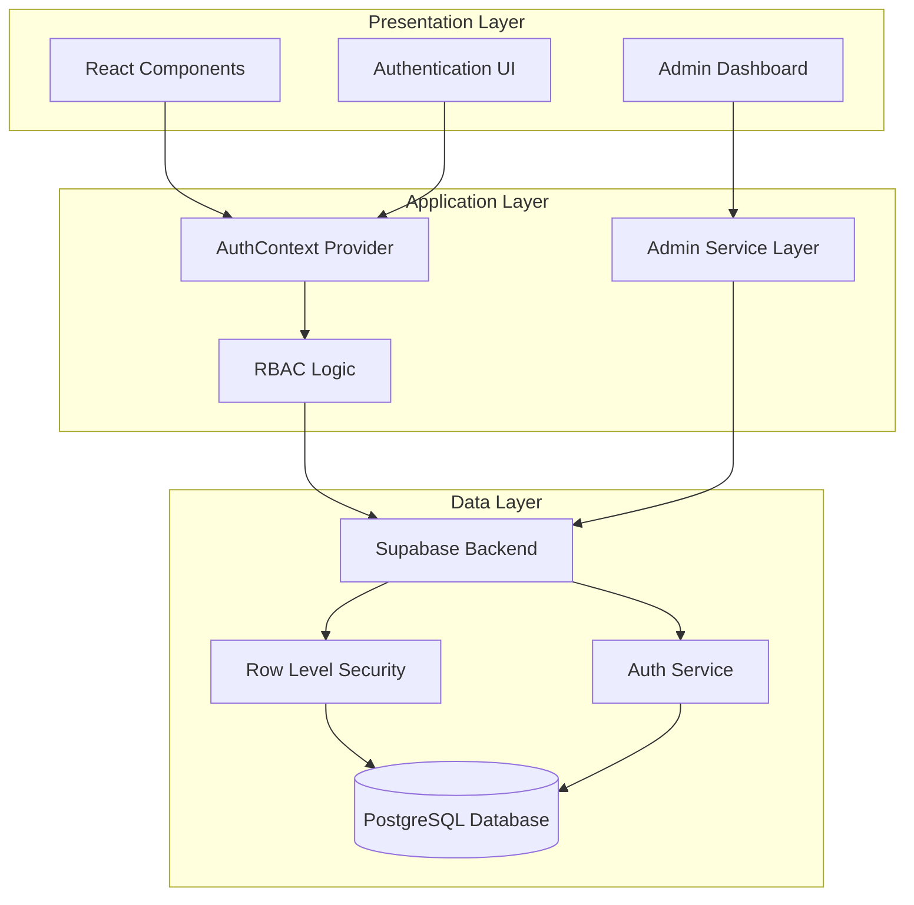
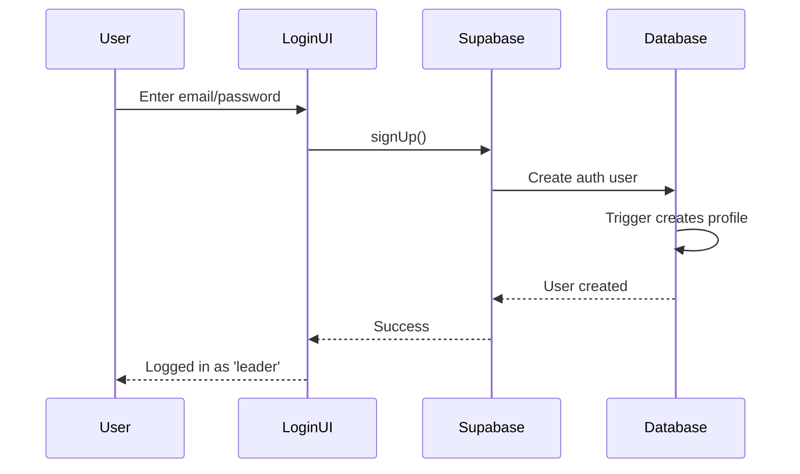
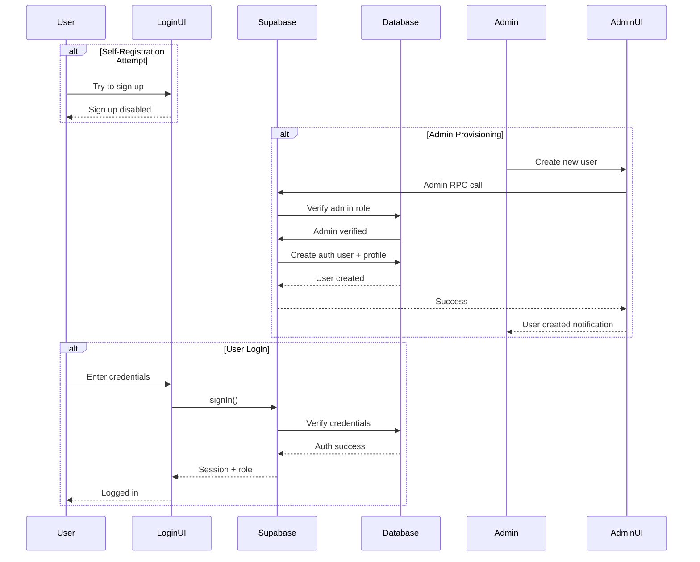

# Admin User Management and Branding - Technical Design

## Overview

This feature implements a comprehensive admin user management system with church branding integration for the Church Ministry Management System. The design focuses on establishing role-based access control (RBAC), restricting user registration to admin-only creation, and integrating church-specific branding assets throughout the application.

The system will transform the current self-registration model into an admin-controlled user provisioning system where only the designated admin (konda@gmail.com, UID: 6787d2e2-862c-4160-a96a-878c84e89d25) can create new user accounts. Additionally, church branding assets (flc pic.webp and flc pic 2.webp) will replace generic placeholders to provide a cohesive, branded user experience.

### Key Design Goals

1. **Security-First RBAC**: Implement robust role-based access control at both database and UI layers
2. **Admin-Controlled Provisioning**: Remove self-registration, enabling only admin-initiated user creation
3. **Branded Experience**: Seamlessly integrate church branding assets across all user touchpoints
4. **Minimal Disruption**: Leverage existing Supabase infrastructure and React component patterns
5. **Scalability**: Design for future role expansion (e.g., senior leader, branch admin)

## Architecture

### System Components

The architecture follows a three-layer approach:



### Authentication Flow Changes

**Current Flow (Self-Registration)**:


**New Flow (Admin-Only Provisioning)**:


### Component Hierarchy

```
App
├── AuthProvider (AuthContext)
│   ├── Login (public route)
│   └── Authenticated Routes
│       ├── Header (with branding)
│       ├── Sidebar (role-filtered navigation)
│       └── Page Components
│           ├── Dashboard
│           ├── Settings (admin-only sections)
│           └── Users (admin-only, NEW)
```

## Components and Interfaces

### 1. Database Layer

#### Profile Schema Extension

The existing `profiles` table already supports the `role` field, but we need to ensure proper constraints and default values:

```sql
-- Profiles table (existing, with clarifications)
CREATE TABLE profiles (
  id UUID PRIMARY KEY REFERENCES auth.users(id) ON DELETE CASCADE,
  email TEXT UNIQUE NOT NULL,
  full_name TEXT,
  role TEXT DEFAULT 'leader' CHECK (role IN ('admin', 'leader')),
  branch_id UUID REFERENCES branches(id),
  avatar_url TEXT,
  created_at TIMESTAMP WITH TIME ZONE DEFAULT TIMEZONE('utc'::text, NOW()) NOT NULL,
  updated_at TIMESTAMP WITH TIME ZONE DEFAULT TIMEZONE('utc'::text, NOW()) NOT NULL
);
```

**Key Points**:
- `role` column already exists with proper CHECK constraint
- Default role is 'leader' for non-admin users
- No schema migration needed, only data updates for the specific admin user

#### Row Level Security (RLS) Updates

New policies to restrict user management operations:

```sql
-- Policy: Only admins can view all profiles with sensitive data
CREATE POLICY "Admins can view all profiles"
  ON profiles FOR SELECT
  USING (
    auth.uid() IN (
      SELECT id FROM profiles WHERE role = 'admin'
    )
  );

-- Policy: Only admins can update user roles
CREATE POLICY "Admins can update user roles"
  ON profiles FOR UPDATE
  USING (
    auth.uid() IN (
      SELECT id FROM profiles WHERE role = 'admin'
    )
  );
```

### 2. Backend Services

#### Admin User Provisioning RPC Function

Create a secure RPC function for admin-only user creation:

```sql
-- Function: create_user_as_admin
-- Purpose: Allow admins to create new users with specified roles
CREATE OR REPLACE FUNCTION create_user_as_admin(
  user_email TEXT,
  user_password TEXT,
  user_full_name TEXT,
  user_role TEXT DEFAULT 'leader',
  user_branch_id UUID DEFAULT NULL
)
RETURNS JSON
LANGUAGE plpgsql
SECURITY DEFINER
AS $$
DECLARE
  new_user_id UUID;
  admin_check BOOLEAN;
  result JSON;
BEGIN
  -- Verify caller is an admin
  SELECT EXISTS(
    SELECT 1 FROM profiles 
    WHERE id = auth.uid() AND role = 'admin'
  ) INTO admin_check;
  
  IF NOT admin_check THEN
    RAISE EXCEPTION 'Unauthorized: Only admins can create users';
  END IF;
  
  -- Validate role
  IF user_role NOT IN ('admin', 'leader') THEN
    RAISE EXCEPTION 'Invalid role: must be admin or leader';
  END IF;
  
  -- Create auth user (using Supabase Admin API via service role)
  -- Note: This requires calling from application layer with service role key
  -- The function will be called from React app which calls Supabase Admin API
  
  result := json_build_object(
    'success', true,
    'message', 'User creation initiated'
  );
  
  RETURN result;
END;
$$;
```

**Important**: Due to Supabase limitations, the actual user creation in `auth.users` must be done via the Supabase Admin API from the application layer using the service role key. The RPC function will handle profile creation and validation.

#### Alternative Approach: Service Layer Function

Since direct `auth.users` manipulation requires service role, we'll implement user creation in the React application layer:

```typescript
// Admin service for user creation (pseudo-code)
class AdminService {
  async createUser(userData: {
    email: string;
    password: string;
    fullName: string;
    role: 'admin' | 'leader';
    branchId?: string;
  }) {
    // 1. Verify current user is admin
    const { data: currentProfile } = await supabase
      .from('profiles')
      .select('role')
      .eq('id', currentUserId)
      .single();
      
    if (currentProfile?.role !== 'admin') {
      throw new Error('Unauthorized');
    }
    
    // 2. Create user via Supabase Admin API
    // This requires service role key (backend only)
    const { data: authUser, error: authError } = await supabaseAdmin.auth.admin.createUser({
      email: userData.email,
      password: userData.password,
      email_confirm: true,
      user_metadata: {
        full_name: userData.fullName,
        role: userData.role,
      },
    });
    
    // 3. Create profile record
    const { data: profile, error: profileError } = await supabase
      .from('profiles')
      .insert({
        id: authUser.user.id,
        email: userData.email,
        full_name: userData.fullName,
        role: userData.role,
        branch_id: userData.branchId,
      });
    
    return { user: authUser.user, profile };
  }
}
```

**Security Note**: The service role key must NEVER be exposed to the client. This operation should be handled via:
- Option A: Netlify/Vercel serverless function
- Option B: Supabase Edge Function
- Option C: Backend API endpoint

For this design, we'll use **Supabase Edge Functions** as they integrate natively with the Supabase ecosystem.

### 3. Frontend Components

#### UserManagement Component (NEW)

Administrative interface for user CRUD operations:

```typescript
interface User {
  id: string;
  email: string;
  full_name: string;
  role: 'admin' | 'leader';
  branch_id: string | null;
  created_at: string;
}

interface UserManagementProps {
  // No props needed, uses AuthContext
}

// Component structure:
// - UserList: Table displaying all users with role badges
// - CreateUserModal: Form for admin to create new users
// - EditUserModal: Form for admin to edit user details/roles
// - DeleteUserConfirmation: Confirmation dialog for user deletion
```

**Features**:
- Table view with sortable columns (email, name, role, created date)
- Search/filter by role, email, or name
- Inline role editing (dropdown with confirmation)
- "Create User" button (opens modal)
- Delete user action (with confirmation)
- Branch assignment (dropdown of available branches)

#### AuthContext Extensions

Update the existing `AuthContext` to support user management:

```typescript
interface AuthContextType {
  // Existing fields
  user: User | null;
  userRole: 'admin' | 'leader' | null;
  isAdmin: boolean;
  isLeader: boolean;
  loading: boolean;
  error: string | null;
  
  // New fields for admin operations
  createUser: (userData: CreateUserData) => Promise<void>;
  updateUserRole: (userId: string, newRole: string) => Promise<void>;
  deleteUser: (userId: string) => Promise<void>;
  listAllUsers: () => Promise<User[]>;
}
```

#### Login Component Updates

Remove the "Create Account" button and self-registration functionality:

```typescript
// Remove:
// - handleSignUp function
// - "Create Account" button
// - Self-registration UI elements

// Add:
// - "Contact Administrator" message for new users
// - Admin contact information display
```

#### Branding Integration Points

**Header Component** (`Header.jsx`):
```typescript
// Replace generic avatar with church logo


// Update greeting with church name
<h2>Good Morning, {userName}! 👋</h2>
<p>Faith Life Church Ministry</p>
```

**Sidebar Component** (`Sidebar.jsx`):
```typescript
// Add church logo to sidebar header
<div className="flex items-center gap-3 mb-10">
  
  <div>
    <h1>Faith Life Church</h1>
    <p>Ministry Management</p>
  </div>
</div>

// Add conditional "Users" menu item for admins only
{isAdmin && (
  <MenuItem 
    icon={Users} 
    label="Users" 
    path="/users" 
  />
)}
```

**Login Component** (`Login.jsx`):
```typescript
// Add church logo to login screen

<h1>Faith Life Church</h1>
<p>Ministry Management System</p>
```

### 4. Role-Based Access Control (RBAC)

#### Higher-Order Component for Route Protection

```typescript
// components/ProtectedRoute.jsx
const ProtectedRoute = ({ 
  children, 
  requiredRole = null,
  fallback = <Navigate to="/" />
}) => {
  const { user, userRole, loading } = useAuth();
  
  if (loading) return <LoadingSpinner />;
  if (!user) return <Navigate to="/login" />;
  
  if (requiredRole && userRole !== requiredRole) {
    return fallback;
  }
  
  return children;
};

// Usage:
<ProtectedRoute requiredRole="admin">
  <UserManagement />
</ProtectedRoute>
```

#### Conditional UI Rendering

```typescript
// Hook for role-based UI
const useRoleAccess = () => {
  const { isAdmin, isLeader } = useAuth();
  
  return {
    canManageUsers: isAdmin,
    canViewAllReports: isAdmin,
    canEditBranches: isAdmin,
    canManageOwnMembers: isLeader || isAdmin,
    canSubmitReports: isLeader || isAdmin,
  };
};

// Usage in components:
const { canManageUsers } = useRoleAccess();

{canManageUsers && (
  <button onClick={openUserManagement}>
    Manage Users
  </button>
)}
```

## Data Models

### User Profile Model

```typescript
interface UserProfile {
  id: string;                    // UUID, references auth.users(id)
  email: string;                 // Unique, required
  full_name: string | null;      // Optional display name
  role: 'admin' | 'leader';      // User role, defaults to 'leader'
  branch_id: string | null;      // UUID, references branches(id)
  avatar_url: string | null;     // Profile picture URL
  created_at: string;            // ISO timestamp
  updated_at: string;            // ISO timestamp
}
```

### User Creation Request Model

```typescript
interface CreateUserRequest {
  email: string;                 // Valid email format
  password: string;              // Min 6 characters (Supabase default)
  full_name: string;             // Required display name
  role: 'admin' | 'leader';      // User role, defaults to 'leader'
  branch_id?: string;            // Optional branch assignment
}
```

### User Update Request Model

```typescript
interface UpdateUserRequest {
  user_id: string;               // Target user UUID
  full_name?: string;            // Optional name update
  role?: 'admin' | 'leader';     // Optional role update
  branch_id?: string | null;     // Optional branch reassignment
}
```

### Admin Bootstrap Data

```typescript
// Initial admin user (already exists in auth.users)
const ADMIN_USER = {
  id: '6787d2e2-862c-4160-a96a-878c84e89d25',
  email: 'konda@gmail.com',
  role: 'admin',
};

// Bootstrap script to update existing user to admin
const bootstrapAdmin = async () => {
  await supabase
    .from('profiles')
    .update({ role: 'admin' })
    .eq('id', '6787d2e2-862c-4160-a96a-878c84e89d25');
};
```

### Branding Assets Model

```typescript
interface BrandingAssets {
  primaryLogo: {
    path: '/src/assets/flc pic.webp',
    usage: ['header', 'login', 'loading screen'],
    dimensions: '500x500px',
  },
  secondaryLogo: {
    path: '/src/assets/flc pic 2.webp',
    usage: ['sidebar', 'footer', 'print headers'],
    dimensions: '500x500px',
  },
  churchName: 'Faith Life Church',
  systemName: 'Ministry Management System',
}
```


## Error Handling

### 1. Authentication Errors

**Scenario**: User login failures
- **Error Types**: Invalid credentials, account not found, account disabled
- **Handling Strategy**: Display user-friendly error messages, log security events
- **Implementation**:
```typescript
try {
  const { data, error } = await supabase.auth.signInWithPassword({
    email,
    password,
  });
  
  if (error) {
    switch (error.message) {
      case 'Invalid login credentials':
        setError('Incorrect email or password');
        break;
      case 'Email not confirmed':
        setError('Please check your email to confirm your account');
        break;
      default:
        setError('Unable to sign in. Please try again later.');
    }
    logSecurityEvent('login_failed', { email, reason: error.message });
  }
} catch (error) {
  setError('An unexpected error occurred');
  logError('login_exception', error);
}
```

### 2. Authorization Errors

**Scenario**: Non-admin users attempting admin operations
- **Error Types**: Insufficient permissions, invalid role
- **Handling Strategy**: Return 403 Forbidden, redirect to home page
- **Implementation**:
```typescript
// In Edge Function or RPC
if (currentUserRole !== 'admin') {
  throw new Error('Forbidden: Admin access required');
  // Returns 403 status
}

// In React component
try {
  await adminService.createUser(userData);
} catch (error) {
  if (error.message.includes('Forbidden')) {
    toast.error('You do not have permission to perform this action');
    navigate('/');
  }
}
```

### 3. User Creation Errors

**Scenario**: Admin creates user with invalid or duplicate data
- **Error Types**: 
  - Email already exists
  - Invalid email format
  - Password too weak
  - Invalid role value
  - Missing required fields
- **Handling Strategy**: Validate on frontend, catch backend errors, provide specific feedback
- **Implementation**:
```typescript
// Frontend validation
const validateUserCreation = (userData: CreateUserRequest): string[] => {
  const errors: string[] = [];
  
  if (!userData.email || !isValidEmail(userData.email)) {
    errors.push('Valid email is required');
  }
  
  if (!userData.password || userData.password.length < 6) {
    errors.push('Password must be at least 6 characters');
  }
  
  if (!userData.full_name || userData.full_name.trim() === '') {
    errors.push('Full name is required');
  }
  
  if (!['admin', 'leader'].includes(userData.role)) {
    errors.push('Invalid role');
  }
  
  return errors;
};

// Backend error handling
try {
  const { data, error } = await supabaseAdmin.auth.admin.createUser({
    email: userData.email,
    password: userData.password,
    email_confirm: true,
  });
  
  if (error) {
    if (error.message.includes('already registered')) {
      throw new Error('A user with this email already exists');
    }
    throw error;
  }
} catch (error) {
  // Log and return user-friendly error
  logError('user_creation_failed', { error, userData: { email: userData.email } });
  throw new Error('Failed to create user: ' + error.message);
}
```

### 4. Database Errors

**Scenario**: Profile creation/update failures
- **Error Types**: Constraint violations, foreign key errors, network timeouts
- **Handling Strategy**: Rollback operations, retry logic, error logging
- **Implementation**:
```typescript
// Transaction-style approach
const createUserWithProfile = async (userData: CreateUserRequest) => {
  let authUserId: string | null = null;
  
  try {
    // Step 1: Create auth user
    const { data: authUser, error: authError } = await supabaseAdmin.auth.admin.createUser({
      email: userData.email,
      password: userData.password,
      email_confirm: true,
    });
    
    if (authError) throw authError;
    authUserId = authUser.user.id;
    
    // Step 2: Create profile
    const { error: profileError } = await supabase
      .from('profiles')
      .insert({
        id: authUserId,
        email: userData.email,
        full_name: userData.full_name,
        role: userData.role,
        branch_id: userData.branch_id,
      });
    
    if (profileError) throw profileError;
    
    return { success: true, userId: authUserId };
    
  } catch (error) {
    // Rollback: Delete auth user if profile creation failed
    if (authUserId) {
      await supabaseAdmin.auth.admin.deleteUser(authUserId);
      logWarning('user_creation_rollback', { userId: authUserId });
    }
    throw error;
  }
};
```

### 5. Branding Asset Errors

**Scenario**: Missing or failed-to-load branding images
- **Error Types**: 404 Not Found, network errors, incorrect paths
- **Handling Strategy**: Fallback to default images, graceful degradation
- **Implementation**:
```typescript
const BrandedImage = ({ src, alt, fallback = '/default-logo.svg' }) => {
  const [imgSrc, setImgSrc] = useState(src);
  
  const handleError = () => {
    console.warn(`Failed to load branding asset: ${src}`);
    setImgSrc(fallback);
  };
  
  return (
    
  );
};
```

### 6. Network and Timeout Errors

**Scenario**: Slow or failed network requests
- **Error Types**: Timeout, connection refused, DNS failure
- **Handling Strategy**: Retry with exponential backoff, loading states, timeout messages
- **Implementation**:
```typescript
const fetchWithRetry = async (
  fn: () => Promise<any>,
  maxRetries = 3,
  delay = 1000
) => {
  for (let i = 0; i < maxRetries; i++) {
    try {
      return await fn();
    } catch (error) {
      if (i === maxRetries - 1) throw error;
      await new Promise(resolve => setTimeout(resolve, delay * Math.pow(2, i)));
    }
  }
};

// Usage
try {
  const users = await fetchWithRetry(() => listAllUsers());
} catch (error) {
  toast.error('Unable to load users. Please check your connection.');
}
```

### 7. Error Logging Strategy

All errors should be logged with appropriate context:

```typescript
interface ErrorLog {
  timestamp: string;
  userId: string | null;
  errorType: string;
  message: string;
  stack?: string;
  context: Record<string, any>;
}

const logError = (errorType: string, error: Error, context?: Record<string, any>) => {
  const errorLog: ErrorLog = {
    timestamp: new Date().toISOString(),
    userId: currentUser?.id || null,
    errorType,
    message: error.message,
    stack: error.stack,
    context: context || {},
  };
  
  // Log to console in development
  if (import.meta.env.DEV) {
    console.error('Error Log:', errorLog);
  }
  
  // Send to monitoring service in production
  if (import.meta.env.PROD) {
    sendToMonitoring(errorLog);
  }
};
```


## Testing Strategy

### Overview

This feature involves authentication infrastructure, database operations, UI components, and third-party service integration (Supabase). **Property-based testing is NOT applicable** because the feature primarily consists of:
- Infrastructure as Code (Supabase RLS policies, Edge Functions)
- Authentication/authorization configuration
- UI rendering and branding integration
- Simple CRUD operations with external dependencies

Instead, we will use a comprehensive testing approach with:
1. **Unit Tests**: Component logic, utility functions, validation
2. **Integration Tests**: Database operations, RLS policies, auth flows
3. **End-to-End Tests**: Complete user journeys, admin workflows
4. **Manual Tests**: UI/UX verification, branding consistency

### 1. Unit Tests

#### Component Tests (React Testing Library)

**AuthContext Tests**:
```typescript
describe('AuthContext', () => {
  it('should identify admin role correctly', async () => {
    // Mock Supabase response with admin user
    const { result } = renderHook(() => useAuth(), {
      wrapper: AuthProvider,
    });
    
    await waitFor(() => expect(result.current.loading).toBe(false));
    expect(result.current.isAdmin).toBe(true);
    expect(result.current.isLeader).toBe(false);
  });
  
  it('should identify leader role correctly', async () => {
    // Mock Supabase response with leader user
    const { result } = renderHook(() => useAuth(), {
      wrapper: AuthProvider,
    });
    
    await waitFor(() => expect(result.current.loading).toBe(false));
    expect(result.current.isAdmin).toBe(false);
    expect(result.current.isLeader).toBe(true);
  });
  
  it('should handle missing profile gracefully', async () => {
    // Mock profile fetch error
    const { result } = renderHook(() => useAuth(), {
      wrapper: AuthProvider,
    });
    
    await waitFor(() => expect(result.current.loading).toBe(false));
    expect(result.current.userRole).toBe('leader'); // Default fallback
  });
});
```

**Login Component Tests**:
```typescript
describe('Login Component', () => {
  it('should not display signup button', () => {
    render(<Login onLogin={jest.fn()} />);
    
    expect(screen.queryByText('Create Account')).not.toBeInTheDocument();
    expect(screen.queryByText('Sign Up')).not.toBeInTheDocument();
  });
  
  it('should display admin contact message', () => {
    render(<Login onLogin={jest.fn()} />);
    
    expect(screen.getByText(/contact administrator/i)).toBeInTheDocument();
  });
  
  it('should show error message on invalid credentials', async () => {
    // Mock failed login
    render(<Login onLogin={jest.fn()} />);
    
    fireEvent.change(screen.getByLabelText(/email/i), {
      target: { value: 'test@test.com' },
    });
    fireEvent.change(screen.getByLabelText(/password/i), {
      target: { value: 'wrongpass' },
    });
    fireEvent.click(screen.getByText('Sign In'));
    
    await waitFor(() => {
      expect(screen.getByText(/incorrect email or password/i)).toBeInTheDocument();
    });
  });
});
```

**UserManagement Component Tests**:
```typescript
describe('UserManagement Component', () => {
  it('should only render for admin users', () => {
    const { rerender } = render(
      <AuthContext.Provider value={{ isAdmin: false }}>
        <UserManagement />
      </AuthContext.Provider>
    );
    
    expect(screen.queryByText('User Management')).not.toBeInTheDocument();
    
    rerender(
      <AuthContext.Provider value={{ isAdmin: true }}>
        <UserManagement />
      </AuthContext.Provider>
    );
    
    expect(screen.getByText('User Management')).toBeInTheDocument();
  });
  
  it('should display list of users', async () => {
    const mockUsers = [
      { id: '1', email: 'admin@test.com', full_name: 'Admin', role: 'admin' },
      { id: '2', email: 'leader@test.com', full_name: 'Leader', role: 'leader' },
    ];
    
    // Mock API response
    render(<UserManagement />);
    
    await waitFor(() => {
      expect(screen.getByText('admin@test.com')).toBeInTheDocument();
      expect(screen.getByText('leader@test.com')).toBeInTheDocument();
    });
  });
  
  it('should open create user modal on button click', () => {
    render(<UserManagement />);
    
    fireEvent.click(screen.getByText('Create User'));
    
    expect(screen.getByText('New User')).toBeInTheDocument();
    expect(screen.getByLabelText(/email/i)).toBeInTheDocument();
  });
});
```

**Validation Tests**:
```typescript
describe('User Creation Validation', () => {
  it('should reject invalid email formats', () => {
    const errors = validateUserCreation({
      email: 'invalid-email',
      password: 'password123',
      full_name: 'Test User',
      role: 'leader',
    });
    
    expect(errors).toContain('Valid email is required');
  });
  
  it('should reject weak passwords', () => {
    const errors = validateUserCreation({
      email: 'test@test.com',
      password: '123',
      full_name: 'Test User',
      role: 'leader',
    });
    
    expect(errors).toContain('Password must be at least 6 characters');
  });
  
  it('should reject invalid roles', () => {
    const errors = validateUserCreation({
      email: 'test@test.com',
      password: 'password123',
      full_name: 'Test User',
      role: 'superadmin', // Invalid
    });
    
    expect(errors).toContain('Invalid role');
  });
  
  it('should accept valid user data', () => {
    const errors = validateUserCreation({
      email: 'test@test.com',
      password: 'password123',
      full_name: 'Test User',
      role: 'leader',
    });
    
    expect(errors).toHaveLength(0);
  });
});
```

### 2. Integration Tests

#### Database and RLS Policy Tests

```typescript
describe('User Profile RLS Policies', () => {
  let supabase: SupabaseClient;
  let adminUser: User;
  let leaderUser: User;
  
  beforeAll(async () => {
    // Setup test users and Supabase client
  });
  
  it('should allow admin to view all profiles', async () => {
    // Sign in as admin
    await supabase.auth.signInWithPassword({
      email: 'admin@test.com',
      password: 'testpass',
    });
    
    const { data, error } = await supabase
      .from('profiles')
      .select('*');
    
    expect(error).toBeNull();
    expect(data.length).toBeGreaterThan(0);
  });
  
  it('should prevent leader from updating other user roles', async () => {
    // Sign in as leader
    await supabase.auth.signInWithPassword({
      email: 'leader@test.com',
      password: 'testpass',
    });
    
    const { error } = await supabase
      .from('profiles')
      .update({ role: 'admin' })
      .eq('id', adminUser.id);
    
    expect(error).not.toBeNull();
    expect(error.message).toContain('denied');
  });
  
  it('should allow admin to update user roles', async () => {
    // Sign in as admin
    await supabase.auth.signInWithPassword({
      email: 'admin@test.com',
      password: 'testpass',
    });
    
    const { error } = await supabase
      .from('profiles')
      .update({ role: 'admin' })
      .eq('id', leaderUser.id);
    
    expect(error).toBeNull();
  });
});
```

#### Edge Function Tests

```typescript
describe('Admin User Creation Edge Function', () => {
  it('should create user when called by admin', async () => {
    const response = await fetch(`${edgeFunctionUrl}/create-user`, {
      method: 'POST',
      headers: {
        'Authorization': `Bearer ${adminToken}`,
        'Content-Type': 'application/json',
      },
      body: JSON.stringify({
        email: 'newuser@test.com',
        password: 'password123',
        full_name: 'New User',
        role: 'leader',
      }),
    });
    
    expect(response.status).toBe(200);
    const data = await response.json();
    expect(data.user.email).toBe('newuser@test.com');
  });
  
  it('should reject user creation when called by non-admin', async () => {
    const response = await fetch(`${edgeFunctionUrl}/create-user`, {
      method: 'POST',
      headers: {
        'Authorization': `Bearer ${leaderToken}`,
        'Content-Type': 'application/json',
      },
      body: JSON.stringify({
        email: 'newuser@test.com',
        password: 'password123',
        full_name: 'New User',
        role: 'leader',
      }),
    });
    
    expect(response.status).toBe(403);
  });
  
  it('should reject duplicate email addresses', async () => {
    // Create user first time
    await fetch(`${edgeFunctionUrl}/create-user`, {
      method: 'POST',
      headers: {
        'Authorization': `Bearer ${adminToken}`,
        'Content-Type': 'application/json',
      },
      body: JSON.stringify({
        email: 'duplicate@test.com',
        password: 'password123',
        full_name: 'User One',
        role: 'leader',
      }),
    });
    
    // Try to create again with same email
    const response = await fetch(`${edgeFunctionUrl}/create-user`, {
      method: 'POST',
      headers: {
        'Authorization': `Bearer ${adminToken}`,
        'Content-Type': 'application/json',
      },
      body: JSON.stringify({
        email: 'duplicate@test.com',
        password: 'password456',
        full_name: 'User Two',
        role: 'leader',
      }),
    });
    
    expect(response.status).toBe(400);
    const data = await response.json();
    expect(data.error).toContain('already exists');
  });
});
```

### 3. End-to-End Tests (Playwright/Cypress)

```typescript
describe('Admin User Management E2E', () => {
  it('should complete full admin user creation flow', async () => {
    // 1. Login as admin
    await page.goto('/login');
    await page.fill('[name="email"]', 'admin@test.com');
    await page.fill('[name="password"]', 'adminpass');
    await page.click('button[type="submit"]');
    
    // 2. Navigate to Users page
    await page.click('text=Users');
    await expect(page).toHaveURL('/users');
    
    // 3. Open create user modal
    await page.click('text=Create User');
    await expect(page.locator('dialog')).toBeVisible();
    
    // 4. Fill in new user details
    await page.fill('[name="email"]', 'newleader@test.com');
    await page.fill('[name="password"]', 'leaderpass123');
    await page.fill('[name="full_name"]', 'New Leader');
    await page.selectOption('[name="role"]', 'leader');
    
    // 5. Submit form
    await page.click('button:has-text("Create")');
    
    // 6. Verify success
    await expect(page.locator('text=User created successfully')).toBeVisible();
    await expect(page.locator('text=newleader@test.com')).toBeVisible();
  });
  
  it('should prevent self-registration on login page', async () => {
    await page.goto('/login');
    
    // Verify no signup button exists
    await expect(page.locator('button:has-text("Sign Up")')).not.toBeVisible();
    await expect(page.locator('button:has-text("Create Account")')).not.toBeVisible();
    
    // Verify admin contact message
    await expect(page.locator('text=Contact administrator')).toBeVisible();
  });
  
  it('should display church branding on all pages', async () => {
    await page.goto('/login');
    
    // Check login page branding
    const loginLogo = page.locator('img[alt*="Faith Life"]');
    await expect(loginLogo).toBeVisible();
    
    // Login and check internal pages
    await page.fill('[name="email"]', 'admin@test.com');
    await page.fill('[name="password"]', 'adminpass');
    await page.click('button[type="submit"]');
    
    // Check sidebar branding
    const sidebarLogo = page.locator('aside img[alt*="FLC"]');
    await expect(sidebarLogo).toBeVisible();
    
    // Check header branding
    const headerLogo = page.locator('header img[alt*="FLC"]');
    await expect(headerLogo).toBeVisible();
  });
});
```

### 4. Manual Testing Checklist

#### Admin User Management
- [ ] Admin can view list of all users
- [ ] Admin can create new user with leader role
- [ ] Admin can create new user with admin role
- [ ] Admin can update existing user's role
- [ ] Admin can delete existing user
- [ ] Admin can assign user to branch
- [ ] Leader cannot access Users page
- [ ] Leader cannot create users
- [ ] Non-authenticated users redirected to login

#### Authentication Flow
- [ ] Login page does not show signup button
- [ ] Login page displays admin contact information
- [ ] Users can log in with valid credentials
- [ ] Invalid credentials show appropriate error
- [ ] Logged-in users see role-appropriate navigation
- [ ] Admin users see "Users" menu item
- [ ] Leader users do not see "Users" menu item

#### Branding Integration
- [ ] Login page displays flc pic.webp
- [ ] Sidebar displays flc pic 2.webp
- [ ] Header displays church logo
- [ ] Church name "Faith Life Church" shown in sidebar
- [ ] System name "Ministry Management System" shown
- [ ] All branding assets load correctly
- [ ] Fallback behavior works if asset fails to load

#### Error Handling
- [ ] Duplicate email error message displayed
- [ ] Weak password validation works
- [ ] Invalid role selection prevented
- [ ] Network errors handled gracefully
- [ ] Permission denied errors show appropriate message
- [ ] Missing required fields validated on frontend

### 5. Test Data Setup

```typescript
// Test fixtures
const TEST_USERS = {
  admin: {
    id: '6787d2e2-862c-4160-a96a-878c84e89d25',
    email: 'konda@gmail.com',
    password: 'adminpassword',
    full_name: 'Admin User',
    role: 'admin',
  },
  leader: {
    email: 'leader@test.com',
    password: 'leaderpassword',
    full_name: 'Test Leader',
    role: 'leader',
  },
};

const setupTestDatabase = async () => {
  // Bootstrap admin user
  await supabase
    .from('profiles')
    .update({ role: 'admin' })
    .eq('id', TEST_USERS.admin.id);
  
  // Create test branches
  const { data: branch } = await supabase
    .from('branches')
    .insert({ name: 'Test Branch', location: 'Test Location' })
    .select()
    .single();
  
  return { branch };
};
```

### Test Coverage Goals

- **Unit Tests**: >80% coverage for business logic and components
- **Integration Tests**: All RLS policies, Edge Functions, auth flows
- **E2E Tests**: Critical user journeys (admin user creation, login, role-based access)
- **Manual Tests**: UI/UX verification, visual regression, branding consistency

